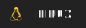

<h1 align="middle">👋 Hello 👋</h1>

I'm **Đạt**, a dabbler in code, and occasional gamer.

---
## Skills

Operating Systems:  

Programming Languages:  

Able to configure & maintain Linux, AlmaLinux servers. Experience with packages such as Apache HTTPD, NGINX, NextCloud and some more.

---

## 📚 Currently working on ... 📚

In 2020/2021 I started to learn HTML, CSS and JavaScript programming.
At the moment I am mostly focused on completing [freeCodeCamp](https://www.freecodecamp.org/ltdat26) challenges.

I've also begun learning React & NodeJS.

## 🗺️ Where to find me ... 🗺️

   

<h2>🤪 Why **Ltdat26**? 🤪</h2>

It is a acronym for my full name. It's sound like "Ltd" which a shortened form for "Limited liability" very frequently see behind the name of a company. And 26 is my date of birth.

<h2>😻 With thanks ... 😻</h2>

Mr [Tarasis](https://github.com/tarasis) 

The shields are from [Shunsuke Mano](https://github.com/progfay/shields-with-icon)
