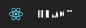

<h1 align="middle">👋 Hello 👋</h1>

I'm **Thành Đạt** _(he, him, they)_, a dabbler in code, and occasional gamer.

---
## Skills

Operating Systems:  

Programming Languages:  

Able to configure & maintain Linux, AlmaLinux servers. Experience with packages such as Apache HTTPD, NGINX, NextCloud and some more.

---
## 🕰️ Short History 🕰️

Once upon a time I was an admin for the company's Linux network. During this time I was responsible for the operation of the building's network (local military base), before also becoming a technician.

After few years working as technician I left and stay at home. In 2018 I got my first Mac, and started to learn Python to keep my hand in.

Then the Data things came along, and I started to learn Data Analysis. Along the way I worked as technical and reviewer on a number of games.

Throughout this time I self hosted my website & email server amongst other things. I've also provided Linux support for others.

## 📚 Currently working on ... 📚

In 2020/2021 I started to learn HTML, CSS and JavaScript programming. At the moment I am mostly focused on completing [freeCodeCamp](https://www.freecodecamp.org/ltdat26) challenges.

I've also begun learning React & NodeJS.

## 🗺️ Where to find me ... 🗺️

I'm all over the place ...

    

<h2>🤪 Why **Ltdat26**? 🤪</h2>

It is a acronym for my full name. It's sound like "Ltd" which a shortened form for "Limited liability" very frequently see behind the name of a company. And 26 is my date of birth.

## 😻 With thanks ... 😻
[Tarasis](https://github.com/tarasis)

The shields are from [Shunsuke Mano](https://github.com/progfay/shields-with-icon)
